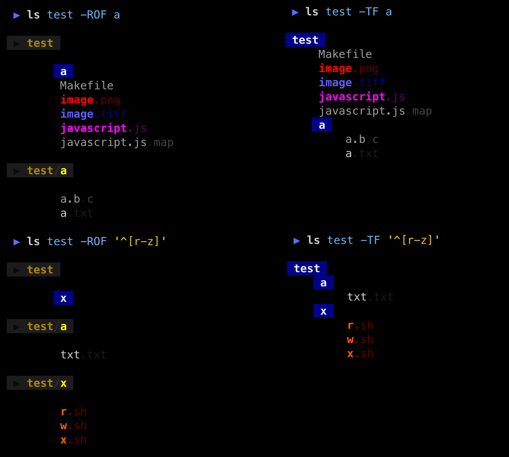
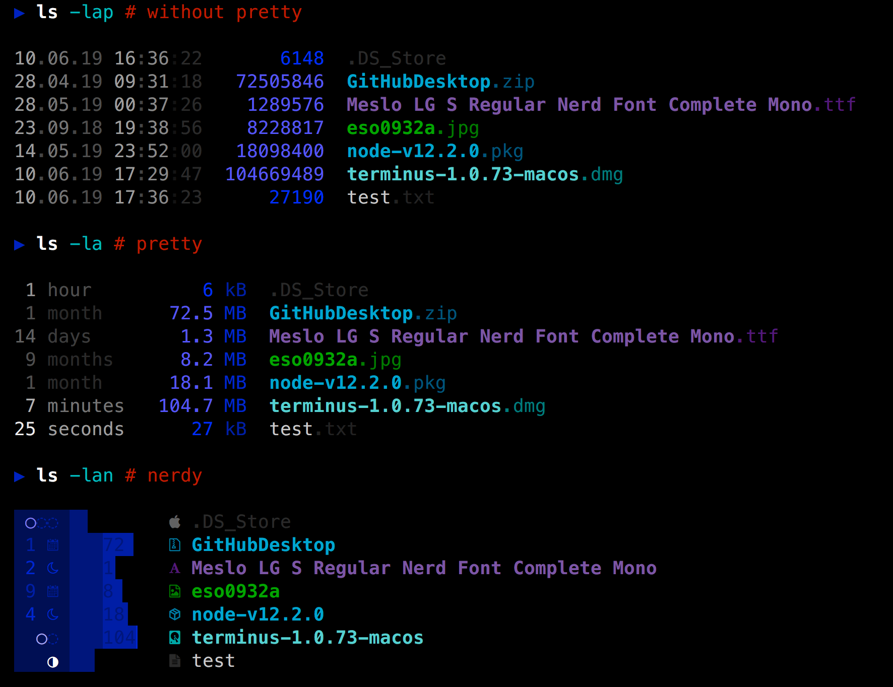

### tree


### find files



### nerd font icons


icon map by [lsd](https://github.com/Peltoche/lsd), works only with a [nerd font](https://github.com/ryanoasis/nerd-fonts)

### pretty nerdy



### usage


### install

```shell
npm install -g color-ls
```

If you don't use `node`, go try out [ls-go](https://github.com/acarl005/ls-go), which is similar to color-ls.

[lsd](https://github.com/Peltoche/lsd) and [exa](https://github.com/ogham/exa) are also quite colorful alternatives.

### notes

* needs a terminal that supports 256 colors
* optimized for dark backgrounds
* call a doctor if your eyes start bleeding :)
